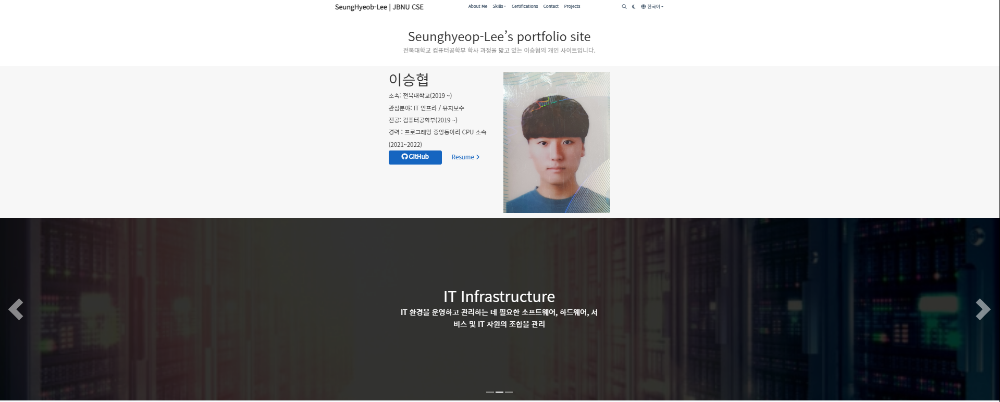
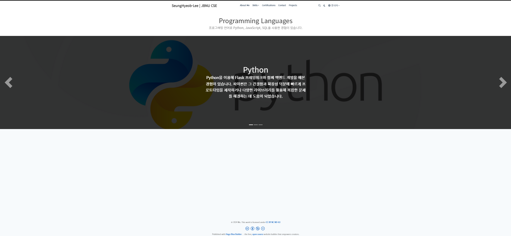
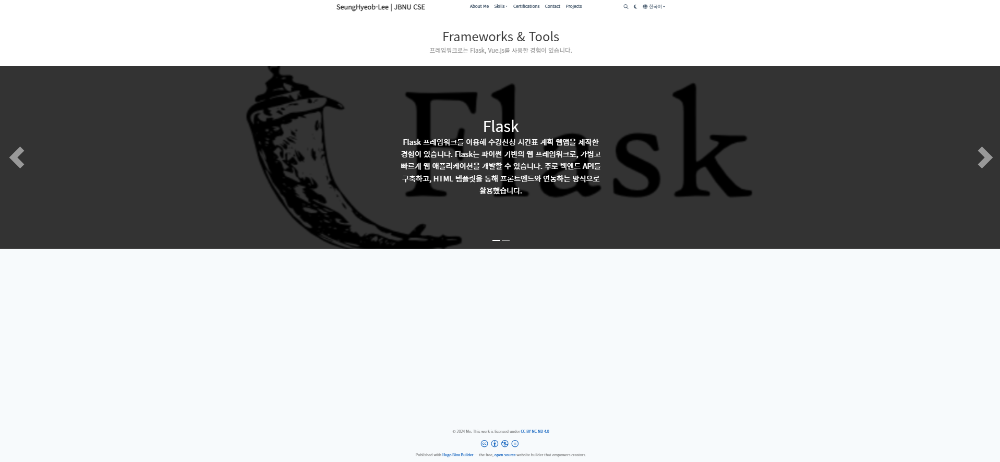

# 포트폴리오 사이트 제작

HUGO 라이브러리를 이용해 정적인 포트폴리오 웹사이트 제작

## 웹사이트 구성

이 웹사이트는 다국어를 지원하며, ko 폴더 아래에 한국어 사이트, en 폴더 아래에 영어로 된 사이트가 담겨있습니다.  
폴더 아래에 있는 파일, 코드들은 텍스트 언어를 제외하면 모두 똑같습니다.

아래 내용 부터는 ko 폴더 기준으로 설명

### 초기 화면(About me 메뉴)


markdown 블록 / hero 블록 / slider 블록으로 구성

### Skills->Programming Languages 서브메뉴, Framworks & Tools 서브 메뉴




markdown 블록/ slider 블록으로 구성

### Break down into end to end tests

Explain what these tests test and why

```
Give an example
```

### And coding style tests

Explain what these tests test and why

```
Give an example
```

## Deployment

Add additional notes about how to deploy this on a live system

## Built With

- [Dropwizard](http://www.dropwizard.io/1.0.2/docs/) - The web framework used
- [Maven](https://maven.apache.org/) - Dependency Management
- [ROME](https://rometools.github.io/rome/) - Used to generate RSS Feeds

## Contributing

Please read [CONTRIBUTING.md](https://gist.github.com/PurpleBooth/b24679402957c63ec426) for details on our code of conduct, and the process for submitting pull requests to us.

## Versioning

We use [SemVer](http://semver.org/) for versioning. For the versions available, see the [tags on this repository](https://github.com/your/project/tags).

## Authors

- **Billie Thompson** - _Initial work_ - [PurpleBooth](https://github.com/PurpleBooth)

See also the list of [contributors](https://github.com/your/project/contributors) who participated in this project.

## License

This project is licensed under the MIT License - see the [LICENSE.md](LICENSE.md) file for details

## Acknowledgments

- Hat tip to anyone whose code was used
- Inspiration
- etc
