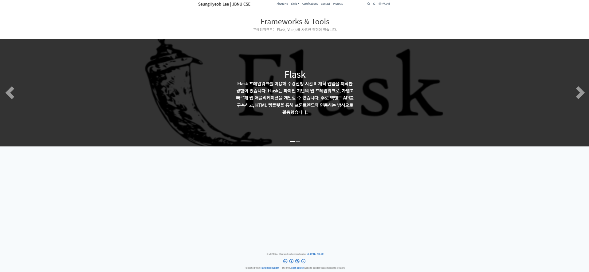
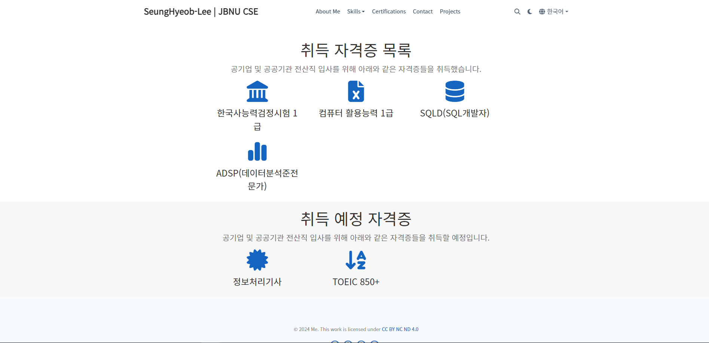
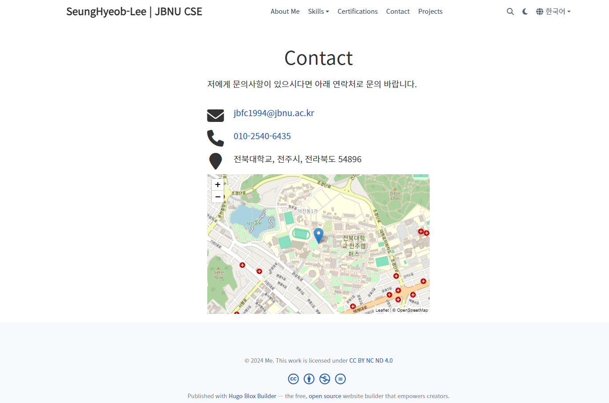
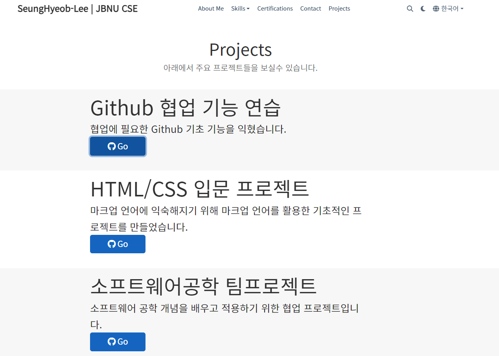

# 포트폴리오 사이트 제작

HUGO 라이브러리를 이용해 정적인 포트폴리오 웹사이트 제작

## 웹사이트 구성

이 웹사이트는 다국어를 지원하며, ko 폴더 아래에 한국어 사이트, en 폴더 아래에 영어로 된 사이트가 담겨있습니다.  
폴더 아래에 있는 파일, 코드들은 텍스트 언어를 제외하면 모두 똑같습니다.

아래 내용 부터는 ko 폴더 기준으로 설명

## 초기 화면(About me 메뉴)

markdown 블록 / hero 블록 / slider 블록으로 구성

## Skills->Programming Languages 서브메뉴, Framworks & Tools 서브 메뉴

markdown 블록/ slider 블록으로 구성

## Certifications

취득한 자격증, 취득할 자격증  
2개의 features 블록으로 구성

## Contact

1개의 contact block으로 이루어져 있으며, 이메일 / 전화번호 / 위치 / 지도를 표시함

## Projects

3개의 hero 블록으로 이루어져 있으며 각 블록마다 프로젝트 이름 / 설명 / 깃허브 repository 링크 버튼 추가
